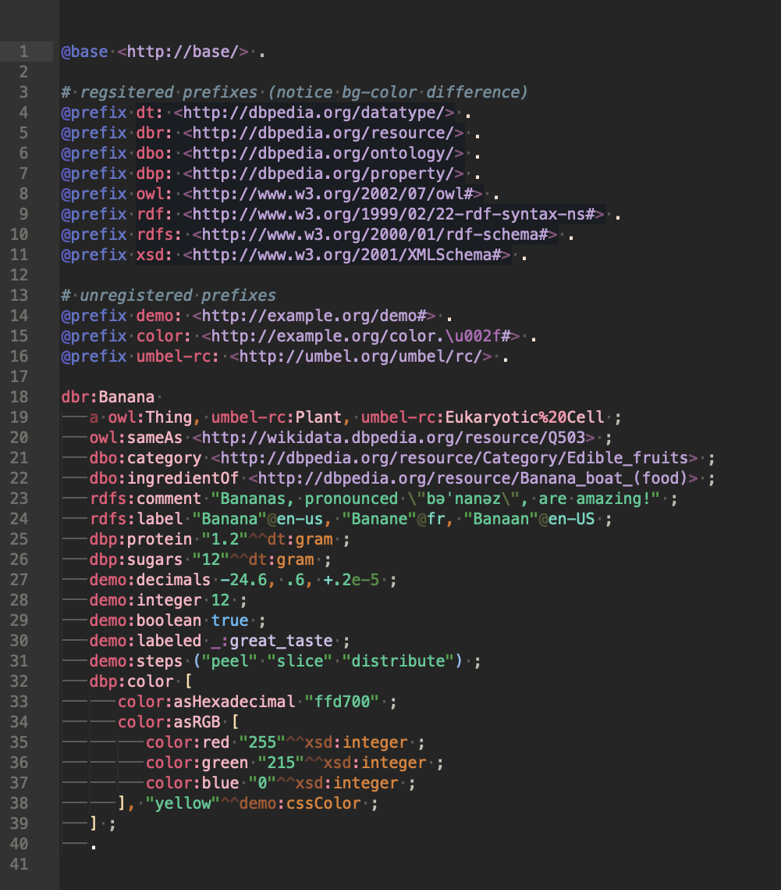
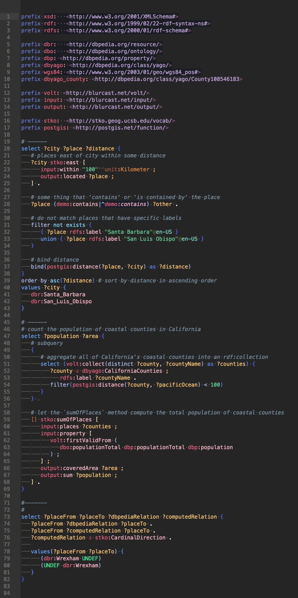
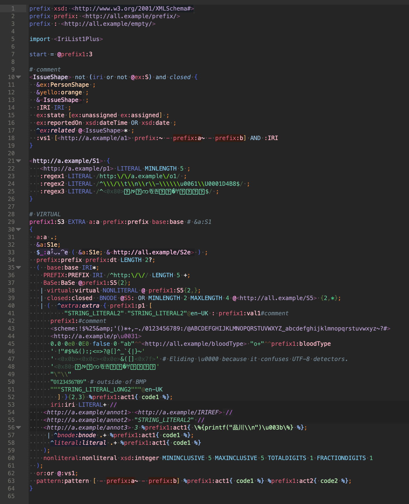
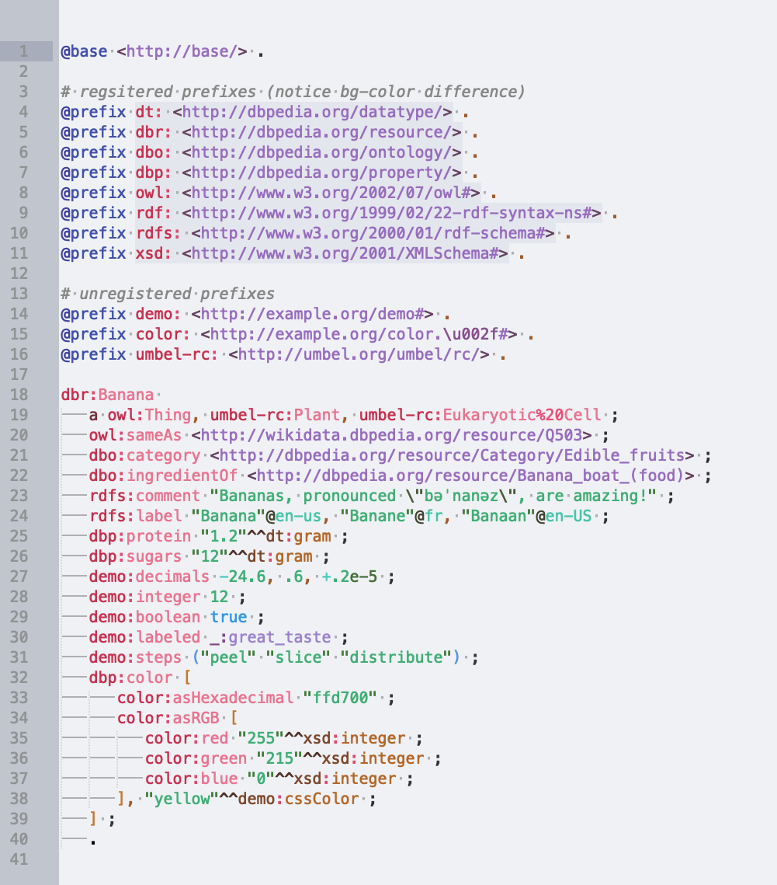
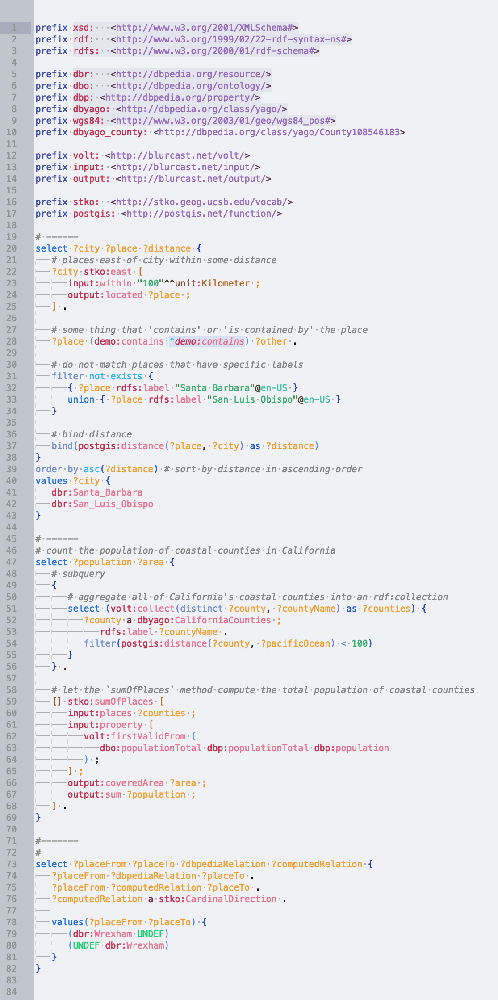
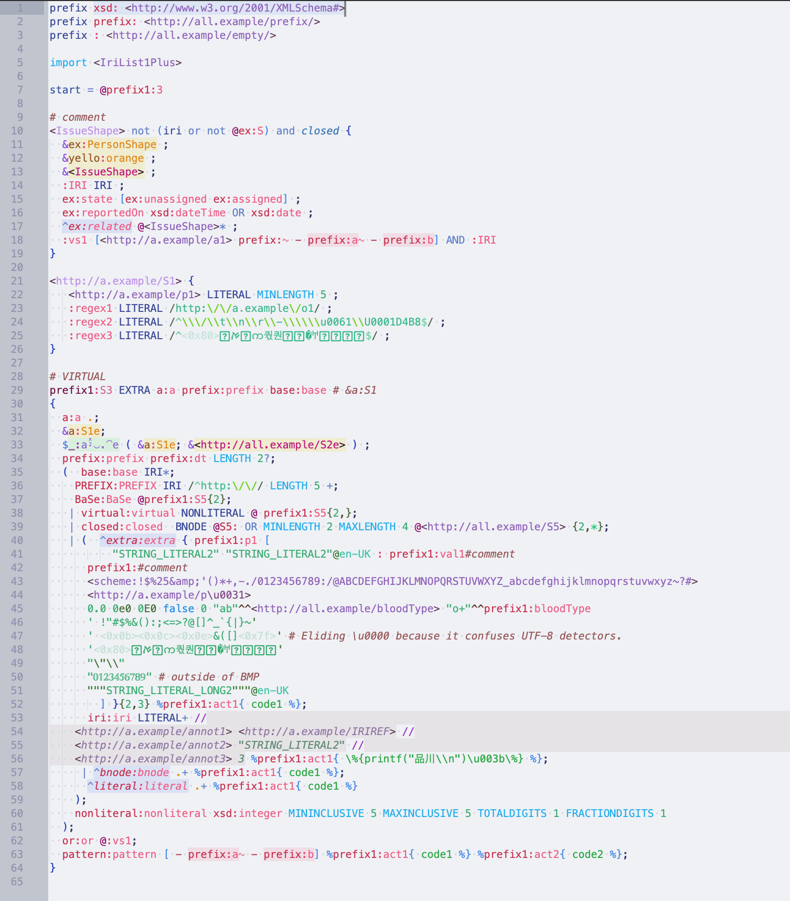

# Syntax highlighting for Linked Data developers

Each syntax highlighter in this package covers the *entire* grammar specification for its language. This provides very high-resolution scopes and immediately shows invalid syntax using special alert highlighting and [all tokens are inspectable](https://superuser.com/questions/848836/how-do-i-see-what-the-current-scope-is-in-sublimetext).

### Install:
Available on [Package Control](https://packagecontrol.io/packages/LinkedData) as `LinkedData` .

Alternatively, you can download the `.sublime-package` file (or the source code archives) from the [Releases](https://github.com/blake-regalia/linked-data.syntaxes/releases).

#### Features:
 - Highly-resolution scoping allows for very detailed color schemes.
 - Malformed syntax detection. Expected token(s) are [inspectable via scope name](https://superuser.com/questions/848836/how-do-i-see-what-the-current-scope-is-in-sublimetext).
 - Auto-completion and validation for prefix mappings registered on [prefix.cc](http://prefix.cc).

#### Currently supported languages:
 - [SPARQL 1.1](https://www.w3.org/TR/sparql11-query/) and [SPARQL*](https://blog.liu.se/olafhartig/2019/01/10/position-statement-rdf-star-and-sparql-star/)
 - [RDF 1.1 Turtle](https://www.w3.org/TR/turtle/) (TTL), [Turtle*](https://blog.liu.se/olafhartig/2019/01/10/position-statement-rdf-star-and-sparql-star/), and [RDF 1.1 TriG](https://www.w3.org/TR/trig/)
 - [ShExC 2.1](https://shex.io/shex-semantics/#shexc)
 - [RDF 1.1 N-Triples](https://www.w3.org/TR/n-triples/) (NT) and [RDF 1.1 N-Quads](https://www.w3.org/TR/n-quads/) (NQ)
 - [Notation3](https://www.w3.org/TeamSubmission/n3/) (N3)

#### Currently supported platforms:
 - Sublime Text 3

#### Currently supported color themes:
 - Macaron Dark
 - Macaron Light (in beta)

#### *Planned langauage support*:
 - OWL Manchester
 - OWL Functional-Style
 - RDFa
 - JSON-LD

#### *Planned platform support*:
 - Atom
 - CodeMirror
 - Emacs
 - minted (LaTeX)
 - ~Ace~

#### *Planned color theme support*
 - *Suggestions?*


### Activating the Light Color Scheme
This package ships with two color schemes which were designed specifically for the high-resolution scopes that the syntax highlighting definitions create. By default, this package will use the [Macaron Dark](#macaron-dark) color scheme. If you prefer to use [Macaron Light](#macaron-light), you'll need to create a settings file to override the syntaxes defined below:

First, create a new file in Sublime and paste these contents into it:
```json
// These settings will override both User and Default settings for the specific LinkedData syntaxes
{
	"color_scheme": "Packages/LinkedData/macaron-light.sublime-color-scheme"
}
```

Next, save this file as `LinkedData.sublime-settings` under the `User/` folder in the [Sublime Text 3 Packages directory](https://stackoverflow.com/a/49967132/1641160). That is, the path should end with: `[...]/Packages/User/LinkedData.sublime-settings` .

Finally, create a new symbolic link to this file for each syntax. The files should be in the same `User` subdirectory as the other file:

For Linux and Mac, open terminal in this directory and run:
```bash
ln -s LinkedData.sublime-settings n-triples.sublime-settings
ln -s LinkedData.sublime-settings n-quads.sublime-settings
ln -s LinkedData.sublime-settings turtle.sublime-settings
ln -s LinkedData.sublime-settings trig.sublime-settings
ln -s LinkedData.sublime-settings notation3.sublime-settings
ln -s LinkedData.sublime-settings shex.sublime-settings
ln -s LinkedData.sublime-settings sparql.sublime-settings
```

For Windows, open command prompt in this directory and run:
```cmd
mklink n-triples.sublime-settings  LinkedData.sublime-settings
mklink n-quads.sublime-settings    LinkedData.sublime-settings
mklink turtle.sublime-settings     LinkedData.sublime-settings
mklink trig.sublime-settings       LinkedData.sublime-settings
mklink notation3.sublime-settings  LinkedData.sublime-settings
mklink shex.sublime-settings       LinkedData.sublime-settings
mklink sparql.sublime-settings     LinkedData.sublime-settings
```

This will override the default color scheme when any of these syntaxes are loaded in the current view.


---

## Previews:

### Macaron Dark

#### Turtle:


#### SPARQL:


#### ShExC:


### Macaron Light

#### Turtle:


#### SPARQL:


#### ShExC:


