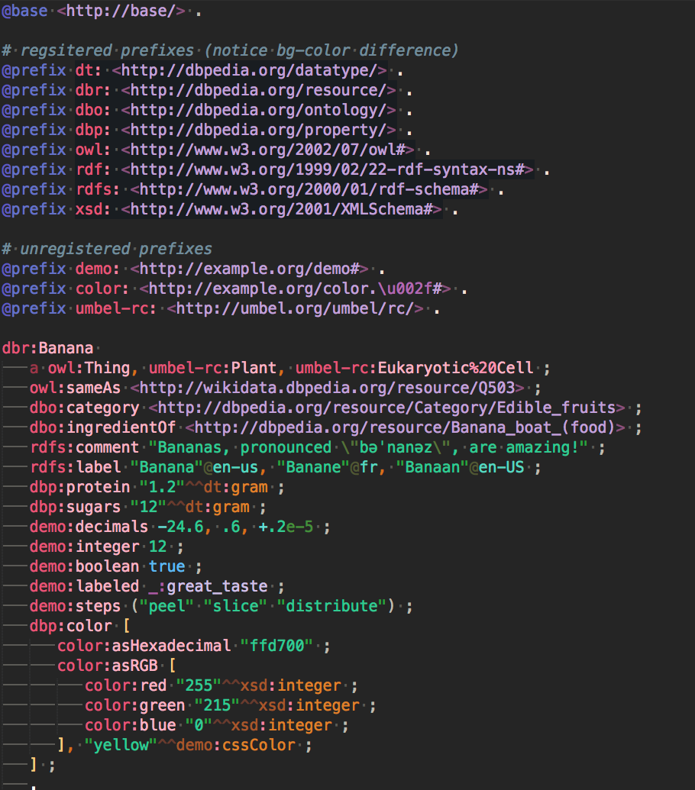
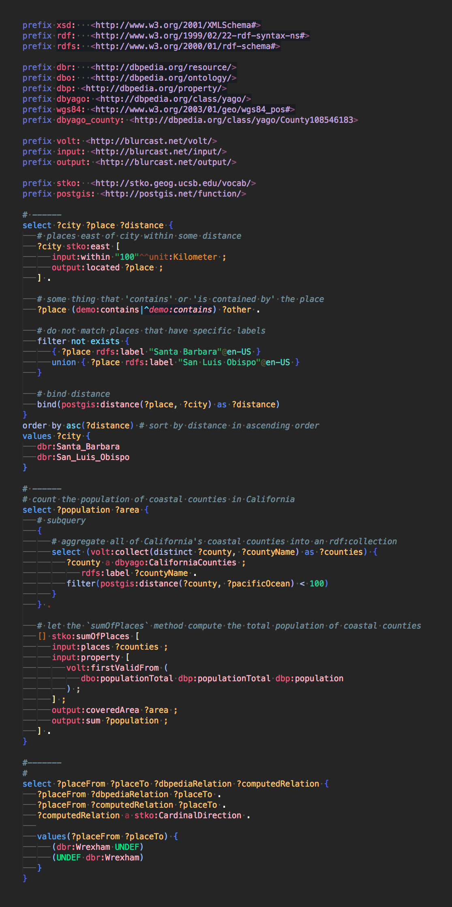

# Syntax highlighting definitions for various Linked Data languages

Each syntax highlighter reflects a complete implementation of the grammar specification for its language. This provides highly-specific scoping and instant feedback on malformed code (i.e., invalid or misplaced tokens are easily identified).

#### Features:
 - Highly-specific scoping allows for very detailed color schemes.
 - Malformed syntax detection. Expected token(s) are inspectable via scope name.
 - Auto-completion and validation for prefix mappings registered on [prefix.cc](http://prefix.cc).

#### Currently supported languages:
 - SPARQL 1.1
 - Turtle (TTL)
 - TriG
 - N-Triples (NT)
 - N-Quads (NQ)
 - Notation3

#### Currently supported platforms:
 - Sublime Text 3
 - Ace

#### Currently supported color themes:
 - Macaroon Dark
 - Macaroon Light (in beta)

#### *Planned langauage support*:
 - ShEx
 - RDFa
 - JSON-LD

#### *Planned platform support*:
 - Atom
 - CodeMirror
 - Emacs

#### *Planned color theme support*
 - *Suggestions?*

---

### Previews:

#### Turtle:

#### SPARQL:

